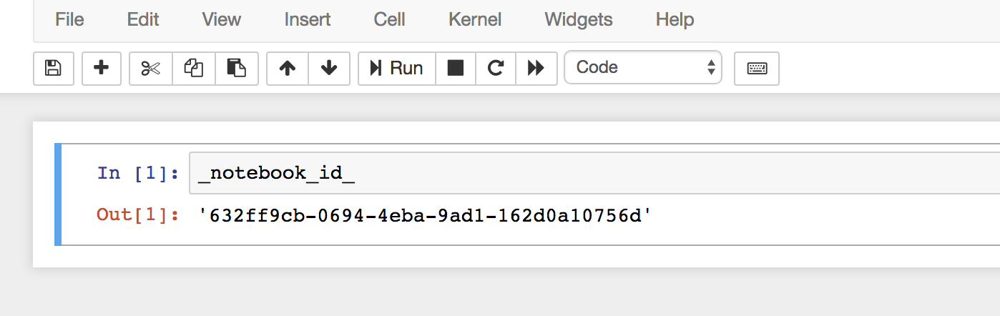

# Notebook ID

With this extension, each Jupyter notebook receives an UUID, which is stored in the metadata of the notebook. Every time the notebook is loaded or the kernel restartet, the UUID is passed to the kernel namespace, where you can access it with '\_notebook\_id\_'.

## Installation

