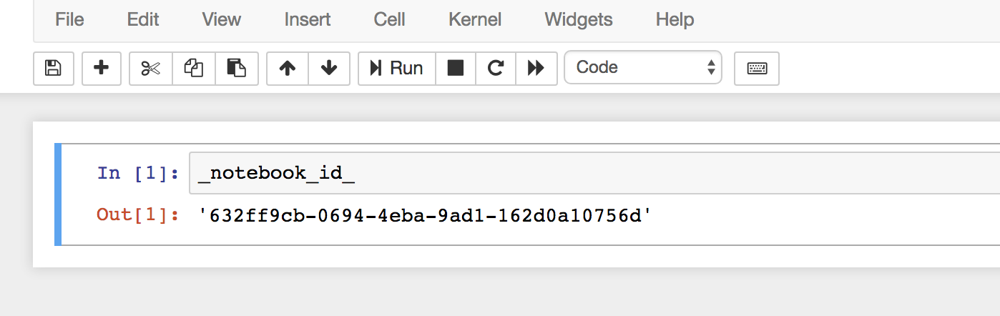

# Notebook ID

With this extension, each Jupyter notebook receives an UUID, which is stored in the metadata of the notebook. Every time the notebook is loaded or the kernel restartet, the UUID is passed to the kernel namespace, where you can access it with '\_notebook\_id\_'. This does currently only work with Python!

## Installation
Clone this repository and run

    jupyter nbextension install notebook_id
    jupyter nbextension enable notebook_id/main
